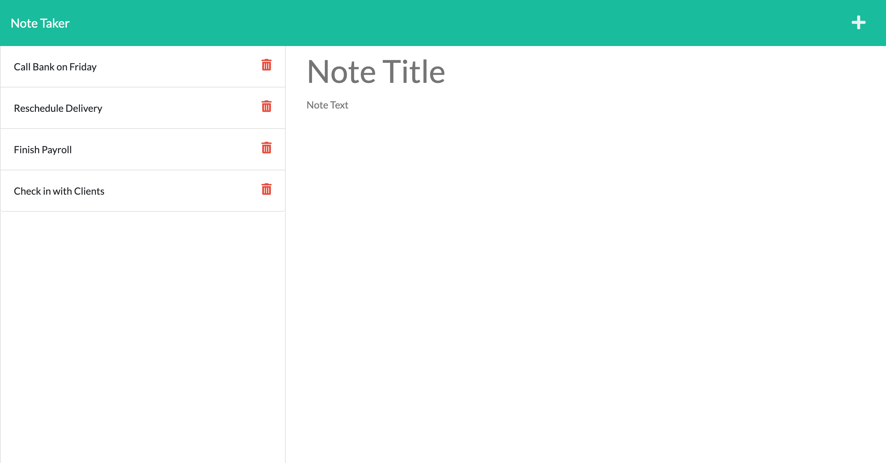

# Note_Taker_Challenge

  
  

  ## Table of Contents
- [Description](#description)
- [Installation](#installation)
- [Usage](#usage)
- [License](#license)
- [Contributors](#contributors)
- [Tests](#tests)
- [Technology Used](#technology-used)
- [Questions](#questions)

## Description
Note Taker is an application that can be used to write and save notes. This application uses an Express.js back end and will save and retrieve note data from a JSON file.

## Installation

The user should clone the repository from GitHub and download Node.js and Express.js.

 
## Usage
If the repo is cloned, call npm start on the command line. When on the application, add notes by clicking on the Note Title and Note Text areas. Save using the save icon on the top right. Users can view previous notes by clicking on them on the left side list. Users can also delete an item by clicking the trash icon for each note.

## License
This application is rendered under MIT

## Contributors
To contribute to Note_taker_challenge, clone this repo locally and commit your code on a separate branch.
  

## Tests
no tests where commited for this project.
## Preview of app final product
  

  -[Link to Live Application](https://desolate-wave-53798.herokuapp.com/)

 

## Technology Used
- HTML
- CSS
- JavaScript
- Node.js
- Express.js

## Questions
Find me on GitHub: https://github.com/mmelendez3
Email me with questions: mele0019@gmail.com